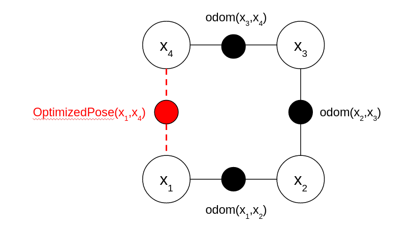

# SemanticLoopClosure
Master thesis regarding LiDAR-based semantic loop closure.


## Introduction

Loop closure is composed of place recognition (loop detection) and optimization. We use F-LOAM as the front end. The pipeline is shown in the following image.

 The place recognition is based on Graph attention neural network. 


The optimization is based on GTSAM (factor-graph optimization toolbox)



## Place Recognition

The code of place recognition module is located in `/src/sgpr_attention` .

### Environment Setup

```
Ubuntu 20.04.3 LTS
Nvidia Driver: 470.57.02    
CUDA: 11.4
```

```shell
conda env create -f environment.yml && conda activate sgpr
cd src/sgpr_attention

### train the model
python3 train.py --config configs/sgpr_geo_attention_attention_fusion.yml --version {VERSION_NAME}

### evaluate the model
python3 evaluate_batch.py --config configs/sgpr_geo_attention_attention_fusion.yml --version {VERSION_TO_TEST}
```


### Data Preprocess

The data preprocessing is quite complicated. You can check  [SGPR](https://github.com/kxhit/SG_PR) repo for details. The biggest difference between it and ours is we add bounding box into the dictionary and we load data from `.npz` to speed up training. You can directly download preprocessed data [here](https://drive.google.com/drive/folders/1tUkrBakDsxrMt-AKHxK1W7oTP5HaFRcN).  Remember to change the parameters in config file.


### Files Breakdown

`configs` store the different model configuration. You can adjust the model parameters and adjust data path here.

`src` the core of the model. 

​		-`dataset` dataloader of different datasets and utility functions to load data.

​		-`model` model realizations.

`experiments` store checkpoints during training.


## Loop Closure

### Experiment Setup

We inherit from repo ISC-LOAM. You can refer to this [link](https://github.com/wh200720041/iscloam)

- [ROS noetic](http://wiki.ros.org/noetic/Installation/Ubuntu)
- [OpenCV](https://docs.opencv.org/4.x/d7/d9f/tutorial_linux_install.html)
- [GTSAM](https://gtsam.org/get_started/)
- [Ceres](http://ceres-solver.org/installation.html)
- [PCL](https://pointclouds.org/downloads/)

### Data Process

We need to convert the [SemanticKitti](http://www.semantic-kitti.org/) dataset to rosbag. We use this [repo](https://github.com/amslabtech/semantickitti2bag).  


### Quick Start

```
mkdir ~/your_workspace && cd your_workspace
mkdir src && cd src

git clone https://github.com/crepuscularlight/SemanticLoopClosure.git
git clone https://github.com/MoriKen254/timed_roslaunch.git

cd .. && catkin_make
source devel/setup.bash

#change data directory in the configs.
#First change the launch/iscloam.launch file (line 4)
#Second change the src/sgpr_attention/configs/sgpr_geo_attention.yml (line #7,8,9,32,33)
#To change checkpoint, adjust in file src/SGPR.py (line 36,37)

#with GPU 
#change iscOptimizationNode.cpp (line 257) topic name loop_closure_python
roslaunch iscloam iscloam_sgpr.launch

#without GPU
#change iscOptimizationNode.cpp (line 257) topic name loop_closure
roslaunch iscloam iscloam.launch
```


### Acknowledgement

We are inspired by two excellent and amazing work [ISC-LOAM](https://github.com/wh200720041/iscloam) and [SGPR](https://github.com/kxhit/SG_PR). On the foundation of them, we develop the semantic method to solve loop closure issue.
